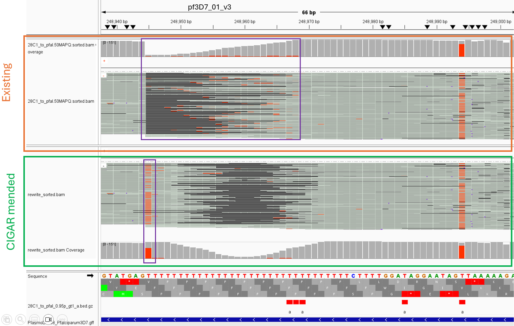

# CIGARMender

CIGARMender - homopolymer-aware deletion centering of aligned reads that preserves modification tags

Homopolymer slippage in nanopore sequencing leads to errors in alignments, these are often left aligned by aligners
to the start of the homopolymer runs which can split information rich k-mers. This tool centres deletions within 
homopolymer runs so that motifs at either end of the homopolymer run are not arbitrarily split. 

It is designed to be conservative in the changes it makes to alignments and does not modify the underlying reads. It purely rewrites the cigar string in ways that conserve how much of the reference is consumed and preserves existing 
aux tags in the input BAM files.

Currently: 

|Read| Seq              | Cigar   | Mod motif | 
| ---| -----------------| --------| ----------|
| R1 | `GAAAAa------CT` | M6D6M2  | AAaAA     |
| R2 | `GAAAAAAa----CT` | M8D4M2  | AAaAA     |
| R3 | `GAAAAAAAAAa-CT` | M11D1M2 | AAaAC     |
| Ref| `GAAAAAAAAAAACT` |         |           |

With CIGARMender: 

|Read| Seq              | Cigar   | Mod motif |
| ---| -----------------| --------| ----------|
| R1 | `GAA------AAaCT` | M3D6M5  | AAaCT     |
| R2 | `GAAA----AAAaCT` | M4D4M6  | AAaCT     |
| R3 | `GAAAAA-AAAAaCT` | M6D1M7  | AAaCT     |
| Ref| `GAAAAAAAAAAACT` |         |           |

## Before and after running CIGARMender
Below are two screenshots taken from within IGV that highlight the problem CIGARMender addresses. Direct RNA sequencing data with m6A modification shown as red. The existing BAM file had left aligned deletions, this caused the m6a modification to not align on the appropriate base and be scattered. After modifying the cigar string to centre homopolymer deletions the m6A marks aligned on the expected motif. 



## Getting started

Download the latest pre-built binary from [releases](https://github.com/stevelan/cigarmender/releases)

Eg: 

```./bin/cigarmender --input ../data/MODBAMS/28C1.sorted.bam --ref ../data/Reference_Genome.fasta```

### Build from source:

Build the project with `make build` will produce a binary in the root of the project directory

Clean the project with `make clean` 

## Relevant XKCD
[XKCD Comic](https://xkcd.com/722/)
